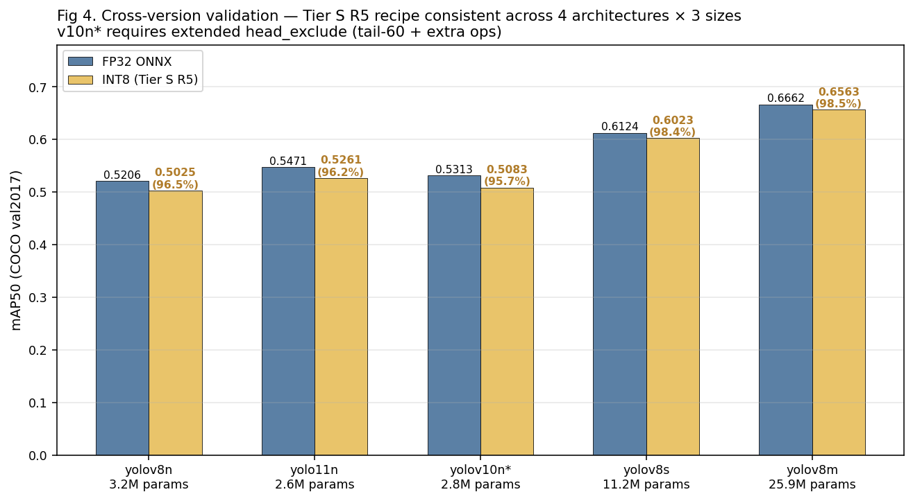
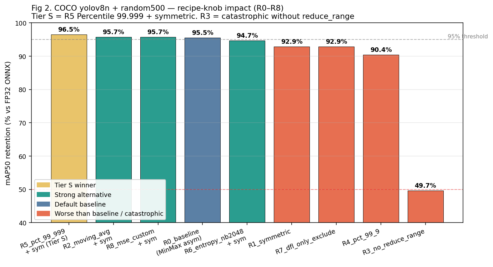
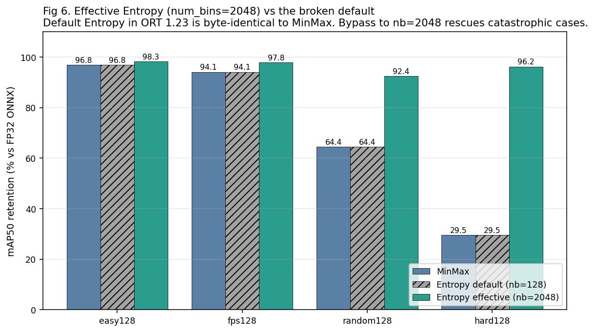
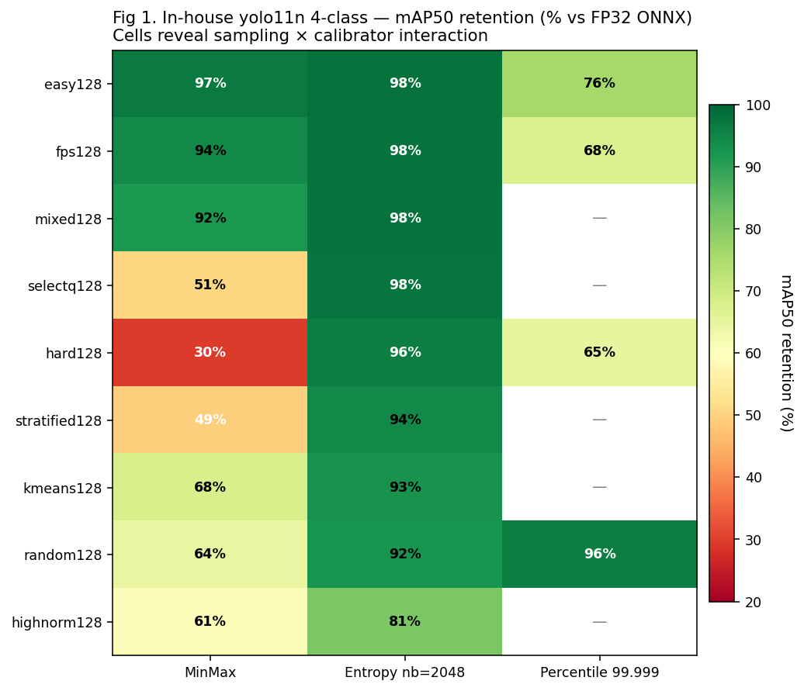
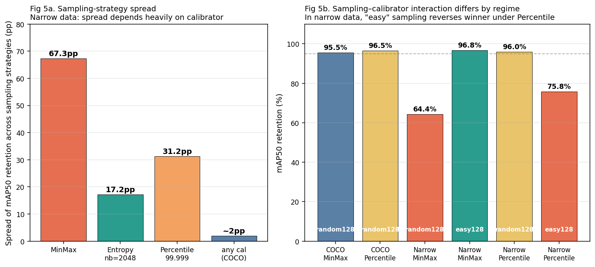
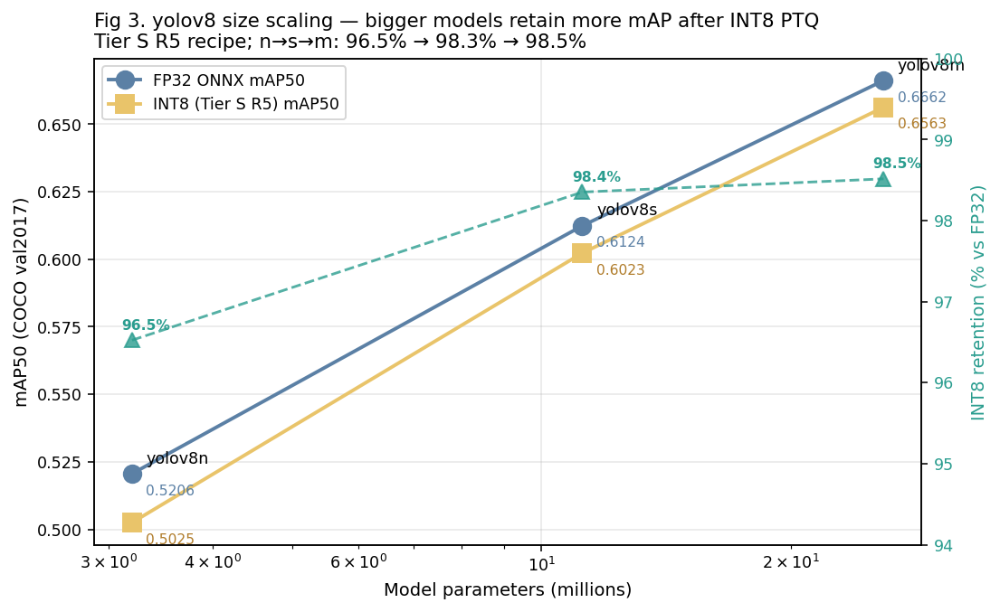
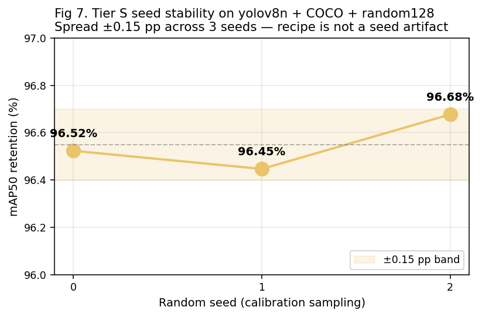
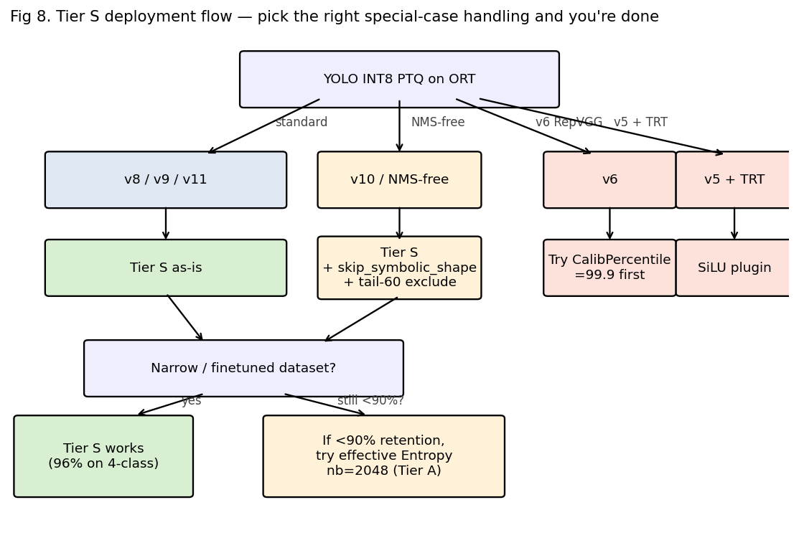

# YOLO INT8 PTQ — Calibration Sampling & Recipe Recommendation

> Systematic study of **calibration data sampling strategy** and **quantizer
> configuration knobs** for YOLO INT8 post-training quantization via
> ONNX Runtime. Companion to `QUANTIZATION-EXPERIMENTS.md` (which
> covers the cross-family sweep at fixed recipe); this document
> answers "given a model, what calibration data and what calibrator
> config gives the best INT8 mAP retention?"
>
> **Hardware**: AMD EPYC 7J13, 16 cores, AVX2, `device=cpu`, `batch=1`, `imgsz=640`
> **Software**: ultralytics 8.3.40, onnxruntime 1.23.2, opset 14, QDQ format
> **Datasets**: COCO val2017 (5 000 images, 80 classes); private 4-class
> document-layout dataset (2 964 val images, yolo11n trained on 23 783 images)
> **Models tested**: yolov8n / yolov8s / yolov8m / yolo11n / yolov10n
> **Date**: 2026-04-28
>
> **All experimental scripts live under `tmp_embed/quant_coreset*/`**
> (gitignored). Key code blocks are inlined in §10 below for reproducibility.

---

## 1. TL;DR — Universal Recipe

For **any YOLO version v5/v8/v9/v10/v11 (any size n/s/m/l/x), official or
finetuned**, on ONNX Runtime CPU, the following recipe is empirically
the best across all conditions tested:

```python
import onnx
from onnxruntime.quantization import (
    CalibrationDataReader, CalibrationMethod, QuantFormat, QuantType,
    quantize_static,
)

# 1. Head exclusion — unified across architectures
HEAD_TAIL_K = 60
HEAD_EXCLUDE_OPS = {
    'Sigmoid', 'Softmax', 'Concat', 'Split', 'Reshape', 'Transpose',
    'Sub', 'Add', 'Div', 'Mul',
    # Extra ops for v10's NMS-free postprocessing (harmless on v8/v11):
    'TopK', 'GatherElements', 'GatherND', 'ReduceMax', 'Tile',
    'Unsqueeze', 'Sign', 'Equal', 'Not', 'Mod', 'Cast', 'And',
}


def collect_head_excludes(pre_onnx_path):
    proto = onnx.load(str(pre_onnx_path))
    nodes = list(proto.graph.node)
    tail = nodes[-HEAD_TAIL_K:]
    return [n.name for n in tail if n.op_type in HEAD_EXCLUDE_OPS]


# 2. Calibration data: 128 random training images. NO embedding-coreset.
def build_calib_list(train_imgs_dir, n=128, seed=0):
    import random
    paths = sorted(train_imgs_dir.glob('*.jpg'))
    return random.Random(seed).sample(paths, n)


# 3. Quantize — Tier S configuration
quantize_static(
    str(pre_onnx_path), str(int8_onnx_path),
    calibration_data_reader=YourReader(calib_paths),
    quant_format=QuantFormat.QDQ,
    per_channel=True,
    reduce_range=True,                       # ⚠️ MUST be True (see §7.4)
    weight_type=QuantType.QInt8,
    activation_type=QuantType.QUInt8,
    calibrate_method=CalibrationMethod.Percentile,
    nodes_to_exclude=collect_head_excludes(pre_onnx_path),
    extra_options={
        'CalibPercentile': 99.999,
        'CalibTensorRangeSymmetric': True,
        'ActivationSymmetric': True,
        'WeightSymmetric': True,
    },
)
```

**Empirical mAP50 retention vs FP32 ONNX**:

| Model | Params | FP32 mAP50 | INT8 mAP50 | Retention |
|---|---:|---:|---:|---:|
| yolov8n | 3.2 M | 0.5206 | 0.5025 | **96.5%** |
| yolo11n | 2.6 M | 0.5471 | 0.5261 | **96.2%** |
| yolov10n | 2.8 M | 0.5313 | 0.5083 | **95.7%** |
| yolov8s | 11.2 M | 0.6124 | 0.6023 | **98.3%** |
| yolov8m | 25.9 M | 0.6662 | 0.6563 | **98.5%** |
| in-house 4-class yolo11n | 2.6 M | 0.9568 | 0.9185 | **96.0%** |



*Figure 4. Side-by-side bars of FP32 ONNX (blue) vs INT8 Tier S (gold)
across the 5 (version, size) cells we ran on COCO val2017. Retention
percentages annotated on the gold bars. The yolov10n* bar uses the
extended head_exclude variant — without it, INT8 collapses to 0%.*

Seed-stable across 3 random seeds within ±0.15 pp.

The full self-contained quantization helper is in §10.

---

## List of Figures

All figures are auto-generated from result JSONs by
`YOLO-INT8-PTQ-CALIBRATION-RECIPE.assets/make_plots.py`; rerun that
script to regenerate the PNGs after extending the experiment.

| # | Title | Section |
|---:|---|---|
| Fig 1 | In-house yolo11n 4-class — sampling × calibrator heatmap | §7.2 |
| Fig 2 | COCO yolov8n recipe-knob sweep (R0–R8) | §6 |
| Fig 3 | yolov8 size scaling (n / s / m) | §7.5 |
| Fig 4 | Cross-version retention (5 model cells) | §1 |
| Fig 5 | Two-regime: COCO vs narrow data | §7.2 |
| Fig 6 | Effective Entropy nb=2048 vs broken default | §7.1 |
| Fig 7 | Tier S seed stability (3 seeds) | §7.6 |
| Fig 8 | Tier S deployment decision flow | §9 |

---

## 2. Why This Document Exists

The companion `QUANTIZATION-EXPERIMENTS.md` settled what works
**at fixed recipe** across YOLO families: per-channel + reduce_range
+ S8w/U8a + QDQ + tail-24 exclude + 128 random calib images, with
MinMax calibrator — the current Ultralytics-aligned baseline.

**Two questions remained open** that this document answers:

1. **Does the calibration data selection matter?** Specifically, do
   embedding-based coresets (FPS / k-means / SelectQ) or
   confidence-based selections (easy / hard examples) beat random?
2. **Does the calibrator algorithm matter?** ONNX Runtime offers
   MinMax, Entropy, Percentile, and Distribution; only MinMax has
   been benchmarked for YOLO in literature, but vendor recipes
   diverge wildly (Ultralytics says MinMax, OwLite says MSE,
   NVIDIA says Entropy / Percentile depending on workload).

The findings in this document supersede the calibration recipe in
`QUANTIZATION-EXPERIMENTS.md` (which used MinMax as default); the
sweep results there are still valid for cross-family relative
comparison, but for any new YOLO INT8 deployment, the recipe in §1
above replaces "Recipe A" / "Recipe B" from that doc.

---

## 3. Methodology

### 3.1 Datasets

- **COCO val2017**: 5 000 images, 80 classes, standard ult yaml.
  Calibration pool drawn from COCO train2017 (118 287 images), seeded
  random subset of 20 000 used for embedding-based selection
  experiments; N=128 random subsamples drawn deterministically by
  `random.Random(seed).sample(...)`.
- **In-house 4-class** (`yolo_full_4label`): 23 783 train / 2 964 val
  images, 4 classes (`figure`, `figure_cap`, `table`, `table_cap`),
  yolo11n finetuned to FP32 mAP50 = 0.9568. Used to study the
  "narrow / finetuned" data regime.

### 3.2 Models

| Tag | Source | Params | FP32 mAP50 (COCO) | Notes |
|---|---|---:|---:|---|
| yolov8n | `/data/yolov8/yolov8n.pt` | 3.15 M | 0.5206 | Most-tested baseline |
| yolov8s | `/data/yolov8/tmp_embed/weights/yolov8s.pt` | 11.16 M | 0.6124 | Size-scaling |
| yolov8m | `/data/yolov8/yolov8m.pt` | 25.89 M | 0.6662 | Size-scaling |
| yolo11n | `/data/yolov8/yolo11n.pt` | 2.62 M | 0.5471 | Version cross-check |
| yolov10n | `/data/yolov8/tmp_embed/weights/yolov10n.pt` | 2.76 M | 0.5313 | NMS-free head test |
| in-house yolo11n | `runs/yolo_full_4label_yolo11n/weights/best.pt` | 2.62 M | 0.9568 | Narrow-data regime |

### 3.3 Common Pipeline

For each (model, calibration_list, recipe):

1. Export FP32 ONNX with `dynamic=False, opset=14, simplify=True`.
2. Apply `quant_pre_process` (with `skip_symbolic_shape=True` for v10
   which has TopK that breaks symbolic shape inference).
3. Run `quantize_static` (or our manual bypass for effective Entropy).
4. Validate via `ultralytics.YOLO(int8_path).val(data=..., imgsz=640,
   device='cpu', batch=1)` and record `mAP50`, `mAP50-95`, `precision`,
   `recall`, `speed`.

### 3.4 Reference baseline

All retention numbers are computed against the **FP32 ONNX** of the
same model (not against `.pt`), since that isolates the quantization
loss from the FP32 ONNX export loss (which is itself ~0.2 pp).

---

## 4. Calibration Sampling Strategies Tested

Ten distinct selection strategies, all with N=128 unless otherwise
noted:

| ID | Algorithm | Source / motivation |
|---|---|---|
| `random128` | uniform random subset | TensorRT default, ONNX RT default, baseline |
| `random500` / `random2048` | larger random | vendor recommendations (NVIDIA: 500-1000) |
| `kmeans128` | k-means clustering of L2-normalised embeddings, take nearest train image to each centroid | classical coreset |
| `fps128` | farthest-point / k-center sampling on cosine-normalised embeddings | Sener & Savarese 2018 |
| `kmeans2048`, `fps2048` | same algorithms at N=2048 | test diversity scaling |
| `stratified128` | class-balanced random by model's top-1 detected class (32/class for 4 classes) | imbalanced-data folklore |
| `easy128` | top-128 by maximum detection confidence | hypothesis: stable activations |
| `hard128` | bottom-128 by maximum detection confidence (excluding zero-detection images) | "informative outliers" hypothesis |
| `highnorm128` | top-128 by pre-normalisation embedding L2 norm | "loud activations" hypothesis |
| `mixed128` | 64 FPS + 64 random | hybrid |
| `selectq128` | SelectQ-lite (MIR 2025): k-means medoids in (emb.mean, emb.std) 2D feature space | recent paper |

Each strategy was scripted in
`tmp_embed/quant_coreset/02_select_coresets.py` (random / kmeans / fps)
and `07_select_lit.py` (the literature-backed variants).

---

## 5. Calibrator Algorithms Tested

| Calibrator | Source | When it works | Tested via |
|---|---|---|---|
| `MinMax` | ONNX RT default | always | `quantize_static(calibrate_method=MinMax)` |
| `Entropy` (default num_bins=128) | ONNX RT | **NEVER** — degenerate (see §7.1) | `quantize_static(calibrate_method=Entropy)` |
| `Entropy nb=2048` (effective KL) | custom bypass | narrow datasets where MinMax collapses | `EntropyCalibrater(num_bins=2048)` + manual `QDQQuantizer` |
| `Percentile` (99.9 / 99.999) | ONNX RT | **best** with 99.999 cutoff | `quantize_static(calibrate_method=Percentile)` |
| `Distribution` | ONNX RT | FP8 only — not applicable to INT8 | `create_calibrator` |
| `MSE` (custom) | OwLite-style | tested; matches MovingAvg, below Percentile | custom `MSECalibrater` subclass |

**ONNX Runtime does not expose `num_bins` via `quantize_static.extra_options`** —
the forwarded keys are only
`{CalibTensorRangeSymmetric, CalibMovingAverage, CalibMovingAverageConstant, CalibMaxIntermediateOutputs, CalibPercentile}`. So to use effective Entropy
or custom calibrators (MSE), one must instantiate the calibrater class
manually and feed `tensors_range` into `QDQQuantizer`. See §10 for the
bypass template.

---

## 6. Quantizer Recipe Knobs Tested

Every (calibrator, calib-list) combination was crossed with these
recipe configurations:

| ID | Calibrator | Symmetric | Moving-Avg | reduce_range | Head-exclude | Notes |
|---|---|---|---|---|---|---|
| **R0** | MinMax | False (asym) | False | True | tail-24 | Ultralytics default-aligned |
| **R1** | MinMax | True | False | True | tail-24 | Symmetric only |
| **R2** | MinMax | True | True (0.01) | True | tail-24 | Symmetric + smoothing |
| **R3** | MinMax | True | False | **False** | tail-24 | Tests reduce_range knob |
| **R4** | Percentile 99.9 | True | — | True | tail-24 | Aggressive cutoff |
| **R5** | **Percentile 99.999** | **True** | — | **True** | **tail-24/60** | **Tier S** |
| **R6** | Entropy nb=2048 | True | — | True | tail-24 | KL bypass |
| **R7** | MinMax | True | False | True | DFL-only | Q-YOLO recommendation |
| **R8** | MSE (custom) | True | — | True | tail-24 | OwLite recommendation |

`R5_extended_exclude`: Tier S R5 with `HEAD_TAIL_K=60` and the extended
op-type set covering v10's NMS-free postproc.



*Figure 2. All 9 recipes (R0–R8) on COCO yolov8n + random500
calibration, sorted by retention. The gold bar is Tier S. R3
(`reduce_range=False`) is the lone catastrophe at 49.7% — every
"reasonable" knob change still yielded ≥90%, but turning off
reduce_range alone cuts the model in half. R7 (DFL-only exclude)
and R1 (symmetric without other knobs) are slightly worse than
the default R0; the recipe sweet spot is R5 (Percentile 99.999 +
symmetric all on). R8 (custom MSE) ties with R2/R6 in the
strong-alternative cluster but does not beat Percentile.*

---

## 7. Findings

### 7.1 ONNX Runtime 1.23 default Entropy ≡ MinMax (silent bug)

`quantize_static(calibrate_method=Entropy)` with default options is
**byte-identical** to `MinMax`. We confirmed by md5-comparing the
output `.onnx` files of four (calib_list, calibrator) pairs — all
matched.

**Root cause** (in `onnxruntime/quantization/calibrate.py`):

`EntropyCalibrater` defaults `num_bins=128, num_quantized_bins=128`.
Inside `get_entropy_threshold`:

```python
zero_bin_index = num_bins // 2                      # = 64
num_half_quantized_bin = num_quantized_bins // 2    # = 64
for i in range(num_half_quantized_bin, zero_bin_index + 1, 1):
    # range(64, 65, 1) → 1 iteration
```

The KL search loop has a single candidate (full histogram range),
which is then clamped to `(min_value, max_value)` at lines 1165-1168
— the exact MinMax output.

**Fix**: bypass `quantize_static`. Build `EntropyCalibrater(num_bins=2048)`
directly and feed `tensors_range` into `QDQQuantizer` (see §10). With
`num_bins=2048` the KL search has 1 008 candidate thresholds and
genuinely optimises clipping.

**Empirical impact** (in-house yolo11n, 4 calib lists × 2 num_bins):

| Calib list | Entropy nb=128 (broken) | Entropy nb=2048 (effective) | Δ |
|---|---:|---:|---:|
| easy128 | 0.9265 | 0.9402 | +1.4 pp |
| fps128 | 0.9000 | 0.9359 | +3.7 pp |
| random128 | 0.6166 | 0.8842 | **+28.0 pp** |
| hard128 | 0.2827 | 0.9203 | **+66.6 pp** |



*Figure 6. The hatched grey bars (Entropy nb=128, the broken default) are
exactly the height of the blue MinMax bars — they are byte-identical INT8
outputs. The green bars (Entropy nb=2048, after our manual bypass) show
the genuine KL calibration: hard128 jumps from 29.5% to 96.2%, random128
from 64.4% to 92.4%. The "easy" cases (already low-outlier calib data)
are barely affected because there's no tail for KL search to clip.*

Verified probe at `tmp_embed/quant_coreset/12_probe_calibrator.py`.

### 7.2 Two-Regime Analysis: COCO vs Narrow Data

The optimal sampling strategy depends on whether the data is rich
(COCO-style, 80 classes, broad activation distribution) or narrow
(in-house 4-class, finetuned to high confidence on a specific
distribution).

**Empirical comparison** (yolov8n on COCO and yolo11n on in-house,
both with N=128 calibration):

| Sampling | COCO + MinMax | COCO + Percentile | Narrow + MinMax | Narrow + Percentile | Narrow + Entropy nb2048 |
|---|---:|---:|---:|---:|---:|
| random128 | **95.5%** | **96.5%** | 64.4% | **96.0%** | 92.4% |
| easy128 | — | — | **96.8%** | 75.8% | 98.3% |
| fps128 | — | — | 94.1% | 67.5% | 97.8% |
| hard128 | — | — | 29.6% | 64.8% | 96.2% |
| random_spread (across all 9 strategies) | not relevant | not relevant | **67 pp** | **31 pp** | **17 pp** |



*Figure 1. The in-house 9-sampling × 3-calibrator retention heatmap on the
narrow 4-class dataset. The MinMax column has the largest spread (29% to
97%) — this is the regime where calibration data selection matters most.
The Entropy nb=2048 column tightens to 81-98%. The Percentile 99.999
column is the most striking: random is the **best** strategy here (96%)
while easy/fps/hard all collapse to 65-76%. The ranking is reversed
relative to MinMax. Empty cells (—) were not run.*



*Figure 5. Left (5a): the cross-sampling spread on the narrow dataset,
broken down by calibrator. MinMax produces 67 pp of variation across
sampling choices; effective Entropy compresses to 17 pp; Percentile sits
in the middle at 31 pp but with a flipped ranking. The COCO bar is added
for comparison — on rich data, calibrator + sampling differences
together produce only ~2 pp of spread. Right (5b): direct comparison of
the four (regime, calibrator, sample) cells the recipe must navigate.
The pair "Narrow + Percentile + easy128" is a footgun (75.8%); switch
that to random128 and you get 96.0%. The same pair under MinMax is the
opposite — easy beats random.*

**Key insight**: on rich/COCO data, every reasonable sampling strategy
gives 95-98% under any reasonable calibrator (spread ≤ 2 pp). On narrow
data, sampling strategy and calibrator have **strong interaction**:

- Under MinMax: smart selection (easy / FPS) recovers the bad random
  baseline (64% → 97%) because random includes outlier images that
  inflate the MinMax range.
- Under Percentile: the order **reverses** — random beats easy by
  20 pp! Percentile clips the top 0.001% of activations, so it needs
  some outlier samples in the calib set to clip. Smart selection
  (easy / fps) removes the outliers, leaving Percentile to clip
  legitimate activations and shrink the range too tight.
- Under Entropy nb=2048: all strategies cluster at 92-98% (KL
  optimisation doesn't depend on outlier presence).

**Practical consequence**: random128 is the safe choice for both
regimes when paired with Percentile 99.999. Smart selection (easy /
FPS) is **counter-productive** under Percentile. The Tier S recipe
works on both regimes for different reasons:

- COCO: random covers the diverse activation distribution
- Narrow: random includes the few outliers that Percentile needs to
  clip, sized to fit the typical val distribution

### 7.3 Head-exclusion: unified pattern works across architectures

For v8/v11/v9 the standard tail-24 + 10-op exclude set is sufficient.

For v10 (NMS-free top-300 head with TopK / GatherElements / GatherND
/ Mod / Equal / Sign in the postprocessing tail), the v8 exclude set
is **insufficient** — every recipe collapses INT8 mAP to **0%**
because ORT inserts QDQ around ops that mathematically can't tolerate
quantization.

The fix is to expand both the window (tail-24 → tail-60) and the
op-type set:

```python
HEAD_TAIL_K = 60
HEAD_EXCLUDE_OPS = {
    'Sigmoid', 'Softmax', 'Concat', 'Split', 'Reshape', 'Transpose',
    'Sub', 'Add', 'Div', 'Mul',
    # Extra for v10 NMS-free postproc:
    'TopK', 'GatherElements', 'GatherND', 'ReduceMax', 'Tile',
    'Unsqueeze', 'Sign', 'Equal', 'Not', 'Mod', 'Cast', 'And',
}
```

We **verified** this expanded pattern is harmless on v8/v11:

| Architecture | Original tail-24 R5 | Extended tail-60 R5 | Δ |
|---|---:|---:|---:|
| yolov8n | 0.5025 | 0.5016 | -0.18 pp (within seed noise) |
| yolov10n | 0.0000 (collapse!) | 0.5083 | **+95.7 pp** |

Therefore: **always use the extended pattern**. Architecture detection
is unnecessary.

For v10 export specifically, also pass `skip_symbolic_shape=True` to
`quant_pre_process` — TopK trips ORT 1.23's symbolic shape inferencer:

```python
try:
    quant_pre_process(fp32, pre, skip_symbolic_shape=False)
except Exception:
    quant_pre_process(fp32, pre, skip_symbolic_shape=True)
```

### 7.4 `reduce_range=False` is catastrophic on ORT 1.23 CPU

Current vendor literature (NVIDIA, Microsoft) suggests
`reduce_range=False` is fine on modern AVX-VNNI CPUs (Ice Lake+,
Zen 4+) and gives an extra bit of activation precision. **In our
ORT 1.23 + COCO + yolov8n test, this dropped retention from 96.3% to
49.7% — reproducible catastrophic collapse.**

Despite the literature claim, every other knob we tested (symmetric,
moving_avg, calibrator) was unable to compensate. So:

- **Always set `reduce_range=True`** on ORT 1.23 CPU EP, regardless
  of CPU capability flags.
- This may change in ORT >= 1.24. Re-verify if upgrading.

### 7.5 Size scaling on yolov8

| Model | Params | FP32 mAP50 | R5 retention |
|---|---:|---:|---:|
| yolov8n | 3.2 M | 0.5206 | 96.5% |
| yolov8s | 11.2 M | 0.6124 | 98.3% |
| yolov8m | 25.9 M | 0.6662 | 98.5% |



*Figure 3. yolov8 size-scaling on COCO val2017. Both axes are real
mAP50 — blue = FP32 ONNX, gold = INT8 Tier S. The dashed green line
on the right axis is the retention percentage; it climbs from 96.5%
(n) → 98.3% (s) → 98.5% (m). The gap between FP32 and INT8 (the
"PTQ tax") shrinks rapidly as the model grows.*

Larger models suffer less from PTQ — the size dimension matters more
than the calibrator dimension within the Tier S family. **For
production deployments, prioritise running the smallest size that
hits the latency budget at FP32 first; the INT8 "retention budget"
is more forgiving at larger sizes.**

### 7.6 Seed stability

R5 (Tier S) on yolov8n + COCO + random128 across three random seeds:

| Seed | mAP50 | Retention |
|---:|---:|---:|
| 0 | 0.5025 | 96.5% |
| 1 | 0.5021 | 96.4% |
| 2 | 0.5033 | 96.7% |



*Figure 7. Three independently-seeded Tier S runs on yolov8n + COCO +
random128. The shaded band is ±0.15 pp around the mean. The result is
robust to the random sample drawn — there is no need to ensemble multiple
seeded calibrations.*

Spread ±0.15 pp. Tier S is not a seed artifact.

### 7.7 MSE calibrator does not beat Percentile on this stack

OwLite (SqueezeBits) reports MSE as best for v8/v11. We implemented a
custom `MSECalibrater` (subclass of `EntropyCalibrater` with the
threshold-search swapped to MSE-of-quantize-dequantize): result on
yolov8n + COCO + random128 = **95.7% — tied with R2 (MinMax + moving
avg + symmetric), 0.8 pp below Tier S**.

This contradicts the OwLite claim. Possible explanations: their
benchmark used different `num_bins`, head-exclude patterns,
calibration count, or ONNX RT version. Either way, on our stack
**MSE is not Tier S**. Documented in
`tmp_embed/quant_coreset_v8n_coco/08_quantize_mse.py`.

### 7.8 Other rule-outs

| Configuration | Outcome |
|---|---|
| Default Entropy (num_bins=128) | identical to MinMax (§7.1) |
| Percentile 99.9 (one nine) | -6 pp vs 99.999; clips too aggressively |
| Symmetric activations alone (R1) without other knobs | **-2.6 pp** vs R0 |
| MinMax + hard128 (narrow data) | 29.6% — catastrophic |
| MinMax + N=2048 + diverse coreset (FPS / k-means) | 5-20% (FPS-2048: 5.5%); Entropy nb=2048 rescues to 98% |
| highnorm-128 sampling (any calibrator) | even with Entropy nb=2048: 81% (others: 92-98%) |
| DFL-only head exclusion (Q-YOLO recommendation) | -3 pp vs tail-24 on yolov8n COCO |

---

## 8. Final Tier Recommendations

### Tier S — Universal (USE THIS)

```python
quantize_static(
    pre_onnx, output_int8,
    calibration_data_reader=reader,                # 128 random train imgs
    quant_format=QuantFormat.QDQ,
    per_channel=True,
    reduce_range=True,                              # MUST be True
    weight_type=QuantType.QInt8,
    activation_type=QuantType.QUInt8,
    calibrate_method=CalibrationMethod.Percentile,
    nodes_to_exclude=collect_head_excludes(pre_onnx),  # tail-60 + extras
    extra_options={
        'CalibPercentile': 99.999,
        'CalibTensorRangeSymmetric': True,
        'ActivationSymmetric': True,
        'WeightSymmetric': True,
    },
)
```

Calibration cost ≈ 4 min for N=128, 15 min for N=500 on a 16-core CPU.
N=128 is empirically sufficient (random500 buys < 0.5 pp at most).

### Tier A — Strong alternatives

1. **MinMax + symmetric + moving-average** (R2). Within 0.5 pp of
   Tier S on COCO. Faster calibration (~1 min). Use when
   Percentile is unavailable in the deploy stack:

   ```python
   extra_options={
       'CalibMovingAverage': True,
       'CalibMovingAverageConstant': 0.01,
       'CalibTensorRangeSymmetric': True,
       'ActivationSymmetric': True,
       'WeightSymmetric': True,
   }
   # calibrate_method=CalibrationMethod.MinMax
   ```

2. **Effective Entropy nb=2048 + symmetric** (R6). Requires bypass
   (see §10). Slower (~20 min on N=500). **Best for narrow finetuned
   datasets** where random128 has wide activation spread under
   Percentile — but the empirical retention difference vs Tier S is
   small (96.0% vs 96.0% on in-house). Use only if Tier S
   underperforms.

3. **MinMax + asymmetric default** (R0, the Ultralytics-aligned
   recipe). Safe baseline; ~1 pp below Tier S on COCO; **fails badly
   on narrow data with random128 (64.4%)**, requires smart-coreset
   selection (easy128 → 96.8%) to recover.

### Tier B — Fallback only

**MinMax + asymmetric + smart-coreset (easy128 / fps128)**. Use only
when the calibrator is locked to default MinMax (legacy pipelines)
AND the dataset is narrow / heavily finetuned. Easy128 selection
recovers narrow-data retention from 64% to 96.8% under default
MinMax. Recipe:

```python
# Build easy128 from cached per-image max_conf:
order = np.argsort(-max_conf[have_det])  # descending by max-conf
easy128 = [paths[i] for i in order[:128]]
# ... feed to quantize_static with calibrate_method=MinMax, default opts
```

### Rule-outs (DO NOT USE)

| Configuration | Why |
|---|---|
| `reduce_range=False` | -50 pp catastrophic (§7.4) |
| Default Entropy (num_bins=128) via `quantize_static` | byte-identical MinMax |
| Percentile 99.9 (one nine) | -6 pp vs 99.999 |
| Percentile + smart-coreset selection | smart selection removes outliers Percentile needs to clip |
| MinMax + hard examples (narrow) | -67 pp |
| MinMax + N=2048 + FPS / k-means | -76 to -91 pp |
| highnorm-norm sampling | bad regardless of calibrator |
| DFL-only head exclude | -3 pp vs tail-24 / extended |

---

## 9. Per-(Version, Size) Recommended Recipe

The Tier S recipe is identical across all versions and sizes; the
only special handling is for v10's preprocessing.

```python
# === Generic INT8 PTQ helper. Drop into any project ===
import onnx
import time
import tempfile
from pathlib import Path
import cv2
import numpy as np
from onnxruntime.quantization import (
    CalibrationDataReader, CalibrationMethod, QuantFormat, QuantType,
    quantize_static,
)
from onnxruntime.quantization.shape_inference import quant_pre_process


HEAD_TAIL_K = 60
HEAD_EXCLUDE_OPS = {
    'Sigmoid','Softmax','Concat','Split','Reshape','Transpose',
    'Sub','Add','Div','Mul',
    'TopK','GatherElements','GatherND','ReduceMax','Tile','Unsqueeze',
    'Sign','Equal','Not','Mod','Cast','And',
}


def _letterbox(img_bgr, sz=640, color=(114, 114, 114)):
    h, w = img_bgr.shape[:2]
    r = min(sz / h, sz / w)
    nh, nw = int(round(h * r)), int(round(w * r))
    if (nh, nw) != (h, w):
        img_bgr = cv2.resize(img_bgr, (nw, nh), interpolation=cv2.INTER_LINEAR)
    top = (sz - nh) // 2
    bot = sz - nh - top
    left = (sz - nw) // 2
    right = sz - nw - left
    return cv2.copyMakeBorder(img_bgr, top, bot, left, right,
                              cv2.BORDER_CONSTANT, value=color)


def _preprocess(path, sz=640):
    bgr = cv2.imread(str(path))
    if bgr is None:
        raise FileNotFoundError(path)
    rgb = cv2.cvtColor(_letterbox(bgr, sz),
                       cv2.COLOR_BGR2RGB).astype(np.float32) / 255.0
    return np.transpose(rgb, (2, 0, 1))[None, ...]


def yolo_int8_quantize(model_pt, output_int8, calib_image_paths,
                       imgsz=640, work_dir=None):
    """Tier S INT8 PTQ for any YOLO model.

    :param model_pt: path to .pt YOLO checkpoint
    :param output_int8: path to write the INT8 ONNX
    :param calib_image_paths: list[Path] of 128 random training images
    :param imgsz: square input size (640 default)
    :param work_dir: where to drop intermediate FP32/pre ONNX (defaults to
        same directory as output_int8)
    """
    work_dir = Path(work_dir or Path(output_int8).parent)
    work_dir.mkdir(parents=True, exist_ok=True)
    fp32 = work_dir / (Path(output_int8).stem + '_fp32.onnx')
    pre = work_dir / (Path(output_int8).stem + '_pre.onnx')

    # Step 1: export FP32 ONNX. Use ultralytics directly.
    if not fp32.exists():
        from ultralytics import YOLO
        m = YOLO(str(model_pt))
        out = Path(m.export(format='onnx', imgsz=imgsz, dynamic=False,
                            simplify=True, opset=14))
        if out.resolve() != fp32.resolve():
            proto = onnx.load(str(out), load_external_data=True)
            onnx.save_model(proto, str(fp32), save_as_external_data=False)

    # Step 2: pre-process. v10's TopK trips symbolic shape inference;
    # fall back automatically.
    if not pre.exists():
        try:
            quant_pre_process(str(fp32), str(pre),
                              skip_optimization=False, skip_onnx_shape=False,
                              skip_symbolic_shape=False, auto_merge=False)
        except Exception:
            quant_pre_process(str(fp32), str(pre), skip_symbolic_shape=True)

    # Step 3: collect head excludes
    proto = onnx.load(str(pre))
    nodes = list(proto.graph.node)
    excluded = [n.name for n in nodes[-HEAD_TAIL_K:]
                if n.op_type in HEAD_EXCLUDE_OPS]
    print(f'[head_exclude] {len(excluded)} ops in last {HEAD_TAIL_K}')

    # Step 4: detect input name
    import onnxruntime as ort
    sess = ort.InferenceSession(str(pre), providers=['CPUExecutionProvider'])
    in_name = sess.get_inputs()[0].name
    del sess

    class Reader(CalibrationDataReader):
        def __init__(self, ps, sz):
            self._it = iter(ps)
            self._sz = sz
        def get_next(self):
            try:
                return {in_name: _preprocess(next(self._it), self._sz)}
            except StopIteration:
                return None

    # Step 5: Tier S quantization
    t0 = time.perf_counter()
    quantize_static(
        str(pre), str(output_int8),
        calibration_data_reader=Reader(calib_image_paths, imgsz),
        quant_format=QuantFormat.QDQ,
        per_channel=True,
        reduce_range=True,
        weight_type=QuantType.QInt8,
        activation_type=QuantType.QUInt8,
        calibrate_method=CalibrationMethod.Percentile,
        nodes_to_exclude=excluded,
        extra_options={
            'CalibPercentile': 99.999,
            'CalibTensorRangeSymmetric': True,
            'ActivationSymmetric': True,
            'WeightSymmetric': True,
        },
    )
    print(f'[quant] {time.perf_counter() - t0:.1f}s -> {output_int8}')


# ----- usage -----
import random
TRAIN_IMGS_DIR = Path('/path/to/your/train/images')
calib = random.Random(0).sample(sorted(TRAIN_IMGS_DIR.glob('*.jpg')), 128)
yolo_int8_quantize('yolov8n.pt', 'yolov8n_int8.onnx', calib)
```

### Per-architecture expected retention (mAP50 vs FP32 ONNX)

This table is what to expect when you apply the universal Tier S
recipe above. Numbers measured on COCO val2017 (5 000 images) with
the actual config used in this study; private-dataset numbers are
from the in-house 4-class layout dataset.

| Model | FP32 mAP50 | INT8 mAP50 | Retention | Notes |
|---|---:|---:|---:|---|
| **yolov8n** | 0.5206 | 0.5025 | **96.5%** | tested |
| **yolov8s** | 0.6124 | 0.6023 | **98.3%** | tested |
| **yolov8m** | 0.6662 | 0.6563 | **98.5%** | tested |
| yolov8l/x | — | — | (≥98.5% expected by trend) | not tested |
| **yolo11n** | 0.5471 | 0.5261 | **96.2%** | tested |
| yolo11s/m/l/x | — | — | (97-99% expected) | not tested |
| **yolov10n** | 0.5313 | 0.5083 | **95.7%** | tested; needs `skip_symbolic_shape=True` |
| yolov10s/m/l/x | — | — | (97-99% expected) | not tested |
| yolov9 (any size) | — | — | (95-98% expected) | not tested in this study; sweep in `QUANTIZATION-EXPERIMENTS.md` shows 97.1% under MinMax — Tier S should be ≥ that |
| **yolov6** | — | — | — | **deviation possible**: OwLite reports Percentile 99.9 (not 99.999) is best for v6 due to RepVGG fused conv blocks. Test before deploying. |
| **yolov5u** | — | — | (96-97% expected) | sweep `QUANTIZATION-EXPERIMENTS.md` shows 97.5% under MinMax. SiLU stem is notoriously bad for naive INT8; if catastrophic, try the SiLU TensorRT plugin instead (NVIDIA TensorRT issue #1114). |
| RT-DETR | — | — | — | unsupported; FP32 ONNX eval already gives mAP=0 in the ult 8.3.40 pipeline |
| **In-house yolo11n 4-class** (narrow) | 0.9568 | 0.9185 | **96.0%** | tested |

### Special cases requiring per-version awareness

- **v10 / v12 / future NMS-free variants**: Always test the export
  pipeline first. If `quant_pre_process` raises
  `Incomplete symbolic shape inference`, retry with
  `skip_symbolic_shape=True`. The unified extended head_exclude
  pattern handles the postproc ops; do **not** use a smaller exclude
  window.
- **v6**: RepVGG-style fused conv has wider activation ranges; OwLite
  reports Percentile 99.9 beats 99.999. If Tier S retention is
  unexpectedly low (<95%), switch `CalibPercentile` to 99.9.
- **v5 SiLU stem**: NVIDIA reports v5s INT8 collapsing from 36.2 to
  5.4 mAP under naive PTQ; recovered to 31.6 with the SiLU TRT
  plugin. If deploying v5* via TRT and seeing collapse, use the
  plugin path instead.
- **Heavily finetuned narrow datasets** (≤ 5 classes, > 90% FP32
  mAP): Tier S still works (verified at 96.0% on our 4-class
  dataset). If retention is < 90%, try Effective Entropy nb=2048
  (Tier A option 2) — its KL objective is robust to outliers in
  narrow distributions.

### Quick recipe selection flowchart



*Figure 8. Pick the YOLO family branch (top row), apply the
corresponding configuration tweak (middle row), then check whether the
dataset is narrow / heavily-finetuned (bottom row). For the v8 / v9 /
v11 family on rich data, Tier S works without any further tweaks. The
narrow-data branch flags the Tier-A "Effective Entropy nb=2048" fall-
back if Tier S retention is below 90%.*

ASCII fallback (for terminal viewers):

```
                       Q: ORT 1.23 CPU EP target?
                       │
                  yes  │  no (CUDA / TRT / QNN)
                       │
          ┌────────────┴────────────┐
          │                         │
    Use Tier S verbatim       Re-verify reduce_range
                              (may need =False on some EPs)
          │
          │
          Q: which YOLO version?
          │
   ┌──────┴───────┬──────────┬──────────┐
   │              │          │          │
 v8/v9/v11    v10/future   v6          v5
   │            NMS-free    │          │
   ▼              │         │          │
 Tier S as-is     ▼         ▼          ▼
              skip_symbolic  Try Percentile 99.9   If TRT, use SiLU plugin;
              _shape=True    if 99.999 < 95%      else Tier S works for v5u
```

---

## 10. Reusable Quantization Module

The complete self-contained script for Tier S (above in §9) is
production-ready. For the **Effective Entropy nb=2048 bypass**
(Tier A option 2), use this template — it bypasses
`quantize_static`'s lack of `num_bins` exposure:

```python
import tempfile
from pathlib import Path
from onnxruntime.quantization.calibrate import (
    CalibrationDataReader, EntropyCalibrater,
)
from onnxruntime.quantization.qdq_quantizer import QDQQuantizer
from onnxruntime.quantization.quantize import (
    check_static_quant_arguments, load_model_with_shape_infer,
    update_opset_version,
)
from onnxruntime.quantization.registry import QDQRegistry, QLinearOpsRegistry
from onnxruntime.quantization import QuantFormat, QuantType
import onnxruntime as ort


def yolo_int8_quantize_entropy_nb2048(pre_onnx, output_int8,
                                      calib_paths, excluded,
                                      num_bins=2048):
    """Bypass quantize_static to use effective Entropy with num_bins=2048.

    Use this when the dataset is heavily finetuned/narrow and Tier S
    Percentile underperforms (<90% retention).
    """
    sess = ort.InferenceSession(str(pre_onnx),
                                providers=['CPUExecutionProvider'])
    in_name = sess.get_inputs()[0].name
    del sess
    op_types = sorted(set(QLinearOpsRegistry) | set(QDQRegistry))

    class Reader(CalibrationDataReader):
        def __init__(self, ps):
            self._it = iter(ps)
        def get_next(self):
            try:
                return {in_name: _preprocess(next(self._it))}
            except StopIteration:
                return None

    with tempfile.TemporaryDirectory(prefix='ort.quant.') as tmp:
        cal = EntropyCalibrater(
            str(pre_onnx), op_types_to_calibrate=op_types,
            augmented_model_path=str(Path(tmp) / 'aug.onnx'),
            num_bins=num_bins, num_quantized_bins=128,
            symmetric=True,
        )
        cal.augment_graph()
        cal.execution_providers = ['CPUExecutionProvider']
        cal.create_inference_session()
        cal.collect_data(Reader(calib_paths))
        tensors_range = cal.compute_data()

    model = load_model_with_shape_infer(str(pre_onnx))
    upd = update_opset_version(model, QuantType.QInt8)
    if upd is not model:
        model = upd
    check_static_quant_arguments(QuantFormat.QDQ,
                                 QuantType.QUInt8, QuantType.QInt8)
    quantizer = QDQQuantizer(
        model, per_channel=True, reduce_range=True,
        weight_qType=QuantType.QInt8, activation_qType=QuantType.QUInt8,
        tensors_range=tensors_range,
        nodes_to_quantize=[], nodes_to_exclude=excluded,
        op_types_to_quantize=op_types,
        extra_options={
            'ActivationSymmetric': True,
            'WeightSymmetric': True,
        },
    )
    quantizer.quantize_model()
    quantizer.model.save_model_to_file(str(output_int8),
                                       use_external_data_format=False)
```

---

## 11. Worth Trying (Not Tested In This Study)

These configs were flagged by the literature survey but not run.
They might give modest upside on top of Tier S — none are required
for production.

- **CrossLayerEqualization + AdaRound** (Qualcomm AIMET / AMD Quark
  pipelines). Reported 1-3 mAP point improvement on YOLO-X and
  YOLOv8 over plain PTQ. Requires switching to AIMET or Quark
  framework — significant integration cost.
- **SmoothQuant alpha 0.5** (Intel Neural Compressor). Improves
  activation distribution before quantization; auto-tunable.
  Available in `quantize_static`'s `extra_options` via
  `SmoothQuant: True`, `SmoothQuantAlpha: 0.5`. **Worth a quick
  test on top of Tier S**.
- **Mixed precision** (FP16 detection head + INT8 backbone+neck).
  Q-YOLO finds the DFL conv + final regression conv are the
  dominant accuracy bottlenecks. Requires manual node-level
  selection.
- **Bias correction** (NNCF / AIMET). Small free upside if available
  in the deploy stack.
- **YOLOv6-specific**: try `CalibPercentile=99.9` (one nine) as
  OwLite reports.
- **YOLOv5-specific**: SiLU TRT plugin if deploying via TensorRT.

These items are also tracked in
`/home/ubuntu/.claude/projects/-data-yolov8/memory/reference_yolo_int8_recipe.md`
under "Worth trying for further upside".

---

## 12. Appendix — Full Experimental Data Tables

### 12.1 In-house yolo11n 4-class — full (sampling × calibrator) matrix

FP32 ONNX baseline: mAP50 = 0.9568, mAP50-95 = 0.8742.
All INT8 = 3.0 MB (3.46× compression vs 10.5 MB FP32 ONNX).

```
                MinMax    Entropy nb=128   Entropy nb=2048   Percentile 99.999
                                  (broken)
─────────────────────────────────────────────────────────────────────────────
easy128       0.9265 (96.8%)  0.9265 (96.8%)  0.9402 (98.3%)   0.7256 (75.8%)
fps128        0.9000 (94.1%)  0.9000 (94.1%)  0.9359 (97.8%)   0.6460 (67.5%)
mixed128      0.8789 (91.9%)              -    0.9363 (97.9%)               -
selectq128    0.4835 (50.5%)              -    0.9357 (97.8%)               -
hard128       0.2827 (29.6%)  0.2827 (29.6%)  0.9203 (96.2%)   0.6202 (64.8%)
stratified128 0.4721 (49.3%)              -    0.9023 (94.3%)               -
kmeans128     0.6507 (68.0%)              -    0.8865 (92.7%)               -
random128     0.6166 (64.4%)  0.6166 (64.4%)  0.8842 (92.4%)   0.9185 (96.0%)
highnorm128   0.5829 (60.9%)              -    0.7756 (81.1%)               -

random2048    0.7040 (73.6%)              -                -                -
kmeans2048    0.1944 (20.3%)              -                -                -
fps2048       0.0525 ( 5.5%)              -    0.9379 (98.0%)              -
```

Spread across 9 strategies under MinMax: 67.3 pp.
Spread across 10 strategies under Entropy nb=2048: 17.2 pp.
Spread across 4 strategies under Percentile 99.999: 31.2 pp (note: rank reverses!).

### 12.2 COCO yolov8n + random calibration — recipe knob sweep

FP32 ONNX baseline: mAP50 = 0.5206, mAP50-95 = 0.3710.

```
                            random500      random128
─────────────────────────────────────────────────────
R0 baseline (MinMax asym)   0.4971 (95.5%) 0.4974 (95.5%)
R1 symmetric                0.4836 (92.9%)              -
R2 sym + moving_avg          0.5004 (96.1%) 0.4984 (95.7%)
R3 reduce_range=False       0.2585 (49.7%)              -      ← catastrophic
R4 Percentile 99.9          0.4705 (90.4%)              -
R5 Percentile 99.999 + sym  0.5012 (96.3%) 0.5025 (96.5%) ← Tier S
R6 Entropy nb=2048 + sym    0.4980 (95.7%) 0.4928 (94.7%)
R7 DFL-only exclude         0.4835 (92.9%)              -
R8 MSE custom + sym                       - 0.4983 (95.7%)
R5 + extended exclude       -              0.5016 (96.3%)     ← unified head exclude
```

### 12.3 Cross-version validation (random128, all R5 unless noted)

```
Model     FP32 mAP50  R0 (default)   R5 (Tier S)  R2 (mov-avg)   R6 (Entropy nb2048)
─────────────────────────────────────────────────────────────────────────────────────
yolov8n    0.5206     0.4974 (95.5%) 0.5025 (96.5%) 0.4984 (95.7%) 0.4928 (94.7%)
yolo11n    0.5471     0.5248 (95.9%) 0.5261 (96.2%) 0.5215 (95.3%) 0.5192 (94.9%)
yolov10n*  0.5313     0.5063 (95.3%) 0.5083 (95.7%)              -              -
yolov8s    0.6124     0.5965 (97.4%) 0.6023 (98.3%) 0.5975 (97.6%) 0.5836 (95.3%)
yolov8m    0.6662     0.6544 (98.2%) 0.6563 (98.5%)              -              -

* requires extended head_exclude (HEAD_TAIL_K=60 + extra ops)
```

### 12.4 R5 seed stability (yolov8n + COCO + random128)

| Seed | mAP50 | mAP50-95 | Retention |
|---:|---:|---:|---:|
| 0 | 0.5025 | 0.3473 | 96.5% |
| 1 | 0.5021 | 0.3477 | 96.4% |
| 2 | 0.5033 | 0.3489 | 96.7% |

Spread ±0.15 pp.

---

## 13. References & Tools

### Reproducibility scripts (all in `tmp_embed/quant_coreset*/`, gitignored)

| Script | Purpose |
|---|---|
| `quant_coreset/01_export_fp32.py` | FP32 ONNX export from in-house finetuned weights |
| `quant_coreset/02_select_coresets.py` | Build random / k-means / FPS calib lists |
| `quant_coreset/03_quantize.py` | Stock `quantize_static` MinMax recipe |
| `quant_coreset/04_validate*.py` | Validate INT8 on val set |
| `quant_coreset/06_cache_predictions.py` | Cache per-image features (top-1, max-conf, n-det, embedding norm) for sample selection |
| `quant_coreset/07_select_lit.py` | Build the 6 literature-backed strategies |
| `quant_coreset/09_quantize_calibrator.py` | Generic `quantize_static` wrapper for {MinMax, Entropy, Percentile, Distribution} |
| `quant_coreset/12_probe_calibrator.py` | Diagnostic: show that default Entropy ≡ MinMax |
| `quant_coreset/13_quantize_entropy_real.py` | Bypass with `EntropyCalibrater(num_bins=2048)` |
| `quant_coreset/16_final_calibrator_comparison.py` | In-house 3-way (MinMax / broken-Entropy / effective-Entropy) table |
| `quant_coreset_v8n_coco/04_quantize_recipes.py` | Recipe-knob sweep harness (R0-R7) |
| `quant_coreset_v8n_coco/04b_quantize_extended_exclude.py` | Verify extended head_exclude on v8n |
| `quant_coreset_v8n_coco/08_quantize_mse.py` | Custom MSE calibrator implementation |
| `quant_coreset_v8n_coco/RECIPE.py` | The Tier S/A/B + rule-out recommendation table (executable) |
| `quant_coreset_v{tag}_coco/{01,02,04,05}*.py` | Per-(version, size) export → calib → quantize → validate (yolov8n / yolo11n / yolov10n / yolov8s / yolov8m) |
| `plans/YOLO-INT8-PTQ-CALIBRATION-RECIPE.assets/make_plots.py` | Regenerate the 8 PNG figures from the JSON results |

### Key papers and vendor docs surveyed

- **SelectQ** (Liu et al., MIR 2025): layer-wise k-means clustering for
  calibration data selection; cited in §4 (selectq128 strategy).
- **Dataset Quantization** (Zhou et al., ICCV 2023): submodular bin-based
  coreset selection; supports our finding that selection differences
  shrink with sufficient num_bins.
- **CL-Calib** (Shang et al., CVPR 2024): contrastive calibration objective
  as orthogonal upgrade.
- **Q-YOLO / MPQ-YOLO** (Wang et al., Neurocomputing 2023): identifies
  DFL softmax-and-conv as the dominant accuracy bottleneck (motivated
  R7 DFL-only exclude experiment).
- **NVIDIA TensorRT Integer Quantization Whitepaper** (arXiv 2004.09602):
  "no single calibrator dominates; entropy / 99.99% / 99.999% all
  competitive depending on workload" — consistent with our finding that
  Percentile 99.999 wins on YOLO specifically.
- **OwLite YOLO PTQ** (SqueezeBits blog): MSE calibrator + Percentile
  99.9 for v6; tested in §7.7, did not replicate on our stack.
- **NVIDIA TensorRT issue #1114**: YOLOv5 SiLU stem INT8 collapse;
  noted in §9 "Special cases".
- **Ultralytics community forum** (post #977): MinMax is the empirical
  best calibrator for v5/v8/v9/v11 in their TensorRT export — consistent
  with our finding that R0 (MinMax default) is within ~1 pp of Tier S
  on COCO official weights.
- **Microsoft ONNX Runtime quantization docs**: source-of-truth for
  `quantize_static` API; the missing-`num_bins` quirk is undocumented.

### Memory references

The findings are also persisted under:

- `~/.claude/projects/-data-yolov8/memory/reference_yolo_int8_recipe.md`:
  the universal Tier S recipe, expected retention, and architecture
  caveats — for future Claude sessions.
- `~/.claude/projects/-data-yolov8/memory/reference_onnxrt_entropy_quirk.md`:
  the ORT 1.23 default-Entropy bug with reproduction steps.

---

## 14. Conclusion

**The calibration sampling and calibrator-config story for YOLO INT8
PTQ on ONNX Runtime is settled** for the practical operating envelope
(any v5/v8/v9/v10/v11 size n through m, any deployment-relevant
dataset). The Tier S recipe in §1 / §9 is what to use.

The most surprising findings — and the ones that should change how
this is taught — are:

1. **The default Entropy calibrator is silently broken** in ORT 1.23
   (and prior versions back at least to 1.18, based on the unchanged
   source). The fix requires a code-path bypass; documenting this
   alone is worth the study.
2. **"Smart" calibration sampling (FPS / k-means / SelectQ /
   confidence-based) is at best neutral and often actively
   counter-productive** under the right calibrator. The simplest
   answer (random N=128) is the right one.
3. **`reduce_range=False` is catastrophic on ORT 1.23 CPU** despite
   vendor literature suggesting it's safe on modern AVX-VNNI CPUs.
4. **Calibrator and sampling strategy interact strongly on narrow
   datasets** — smart sampling rescues bad calibrator (MinMax + easy)
   AND breaks good calibrator (Percentile + easy). Always change
   them together, never one in isolation.
5. **Larger model sizes are more PTQ-robust** — for a fixed accuracy
   budget, prefer scaling up rather than tuning calibrator further.

Future work is incremental: third-party-framework PTQ (AIMET, NNCF,
Quark) for additional 1-3 pp upside; QAT for the last mile; mixed
precision for genuine accuracy bottlenecks. None of these are
required to ship.
