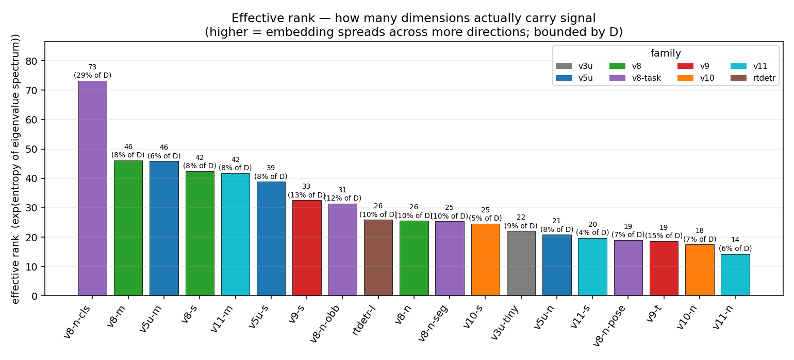
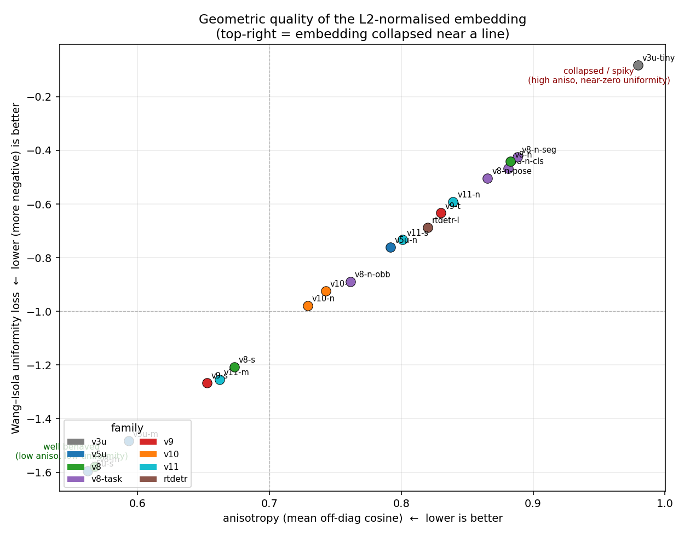
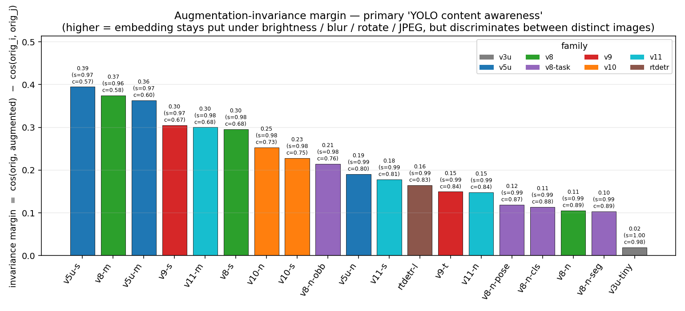
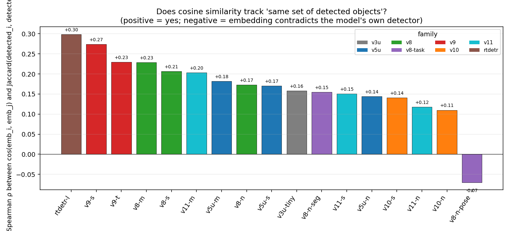
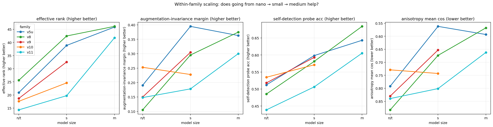
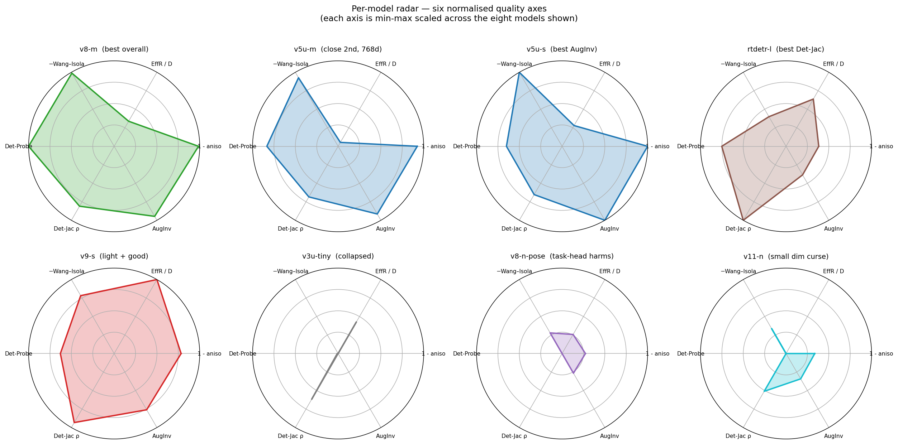
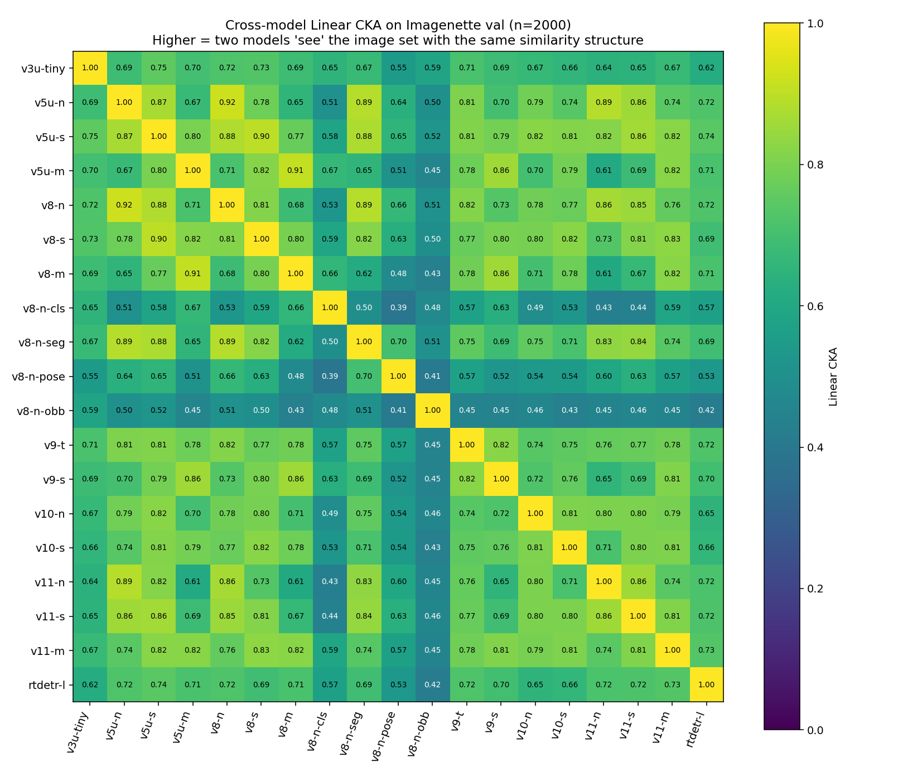

# YOLO embedding quality analysis

> Status: complete — produced `2026-04-27`. All numbers, scripts, raw data, and
> figures referenced below live under
> [`yolo_embedding_quality_analysis.assets/`](./yolo_embedding_quality_analysis.assets).

## TL;DR

Ultralytics' detection / segmentation backbones each emit a 1D image
embedding (the channel-wise pooled feature just before the head). They are
**not** general-purpose representations, but they are *useful* for
similarity search, deduplication, coreset extraction, and clustering on the
images the YOLO model is going to be applied to. This report measures how
mathematically well-behaved those embeddings are.

| Use case | Pick |
| --- | --- |
| Best YOLO-content embedding overall | **`yolov8m`** — leads or co-leads on every YOLO-perspective metric |
| Retrieval where "same set of detected objects" matters | **`rtdetr-l`** — best detection-Jaccard Spearman (0.30) |
| Deduplication / augmentation-robust similarity | **`yolov5su`** — best augmentation invariance (0.39 margin) |
| Light + still good | **`yolov9s`** — 256-d but Det-Jac 0.27 / AugInv 0.31 |
| **Avoid as embedding** | `yolov3-tinyu` (collapsed), `yolov8n-pose` / `yolov8n-obb` (task heads distort backbone), `*-n` nano sizes of v10 / v11 |

The headline finding: **task-specialised heads (pose, obb) measurably
*degrade* the backbone's content awareness** — they push the embedding
away from what their own detector reports. If you want a YOLO-content
embedding, use the plain `*.pt` for that family, not the `-pose` / `-obb`
variant of the same size.

---

## 1. What we are actually measuring

A YOLO model exposes its pre-head feature via
`BaseModel._predict_once(x, embed=[idx])`: the chosen layer's feature map
is run through `adaptive_avg_pool2d → flatten`, giving a single 1D vector
per image. We reuse that exact mechanism (see `yolov8.embed.get_embedding`)
and study the resulting `[N, D]` matrix per model.

The question is not "is this as good as CLIP / DINO" — obviously not, those
were trained on hundreds of millions of image–text pairs explicitly to
*be* embeddings. The question is **how mathematically usable is the
embedding for tasks where YOLO is already the right model** — i.e. on
images you are going to run that same YOLO on anyway. Concretely:

* Does the embedding live in cosine space?
* Does it fill the available dimensions?
* Does similarity in embedding space correspond to similarity *as the
  YOLO model itself perceives it*?
* Is it robust to non-content perturbations (brightness, JPEG, mild
  rotation)?

## 2. Setup

* **Dataset**: Imagenette val (10 classes × 200 images = **2,000 images**).
  N > max embedding dim D (768 for `yolov5mu`), so spectral metrics aren't
  capped by sample count.
* **Models**: 19 official Ultralytics pretrained `.pt` files, covering
  `v3u`, `v5u`, `v8`, `v9`, `v10`, `v11`, `rtdetr`, plus the four `v8`
  task-specialised variants (`-cls`, `-seg`, `-pose`, `-obb`).
* **Embedding layer**: `len(inner.model) - 2` for every model — the same
  default Ultralytics' own `YOLO.embed(source)` uses. For `*-cls` this
  size is 224; everything else uses 640.
* **Hardware**: CUDA 13.0 / Torch 2.11 / Ultralytics 8.3.40.

All numerical artefacts are reproducible by re-running the scripts under
`assets/code/`. CSV / JSON outputs in `assets/data/` capture exactly the
numbers used to render the figures below.

## 3. Metric battery

Two groups: well-known unsupervised geometry of an embedding matrix, and
five metrics designed to test "does this embedding reflect the YOLO
model's own world view".

### 3.1 Generic geometric metrics

| Metric | Definition | Direction |
| --- | --- | --- |
| `anisotropy_mean_cos` | mean off-diagonal cosine of L2-normed `X` (Ethayarajh 2019, Mu & Viswanath 2018) | lower → more isotropic |
| `effective_rank` | `exp(H(p))` with `p_i = λ_i / Σλ_j` over centred-covariance eigenvalues (Roy & Vetterli 2007) | higher → more directions used |
| `stable_rank` | `Σλ / λ_max` | higher → no single direction dominates |
| `participation_ratio` | `(Σλ)² / Σλ²` (Recanatesi et al.) | higher → effective dimensionality high |
| `uniformity_wang_isola` | `log E[exp(-2 ‖x-y‖²)]` on the unit sphere (Wang & Isola 2020) | more negative → more uniformly spread |
| `hubness_skewness_k10` | skewness of k-occurrence count for `k=10` (Radovanović et al. 2010) | lower → no "popular" hub points |
| `twonn_intrinsic_dim` | TwoNN ratio-based intrinsic-dim estimator (Facco et al. 2017) | local manifold dimensionality |
| `knn1_acc_imagenette` | leave-one-out cosine 1-NN accuracy with Imagenette class labels | higher → semantic coherence |

### 3.2 YOLO-perspective metrics (this report's contribution)

These directly probe whether the embedding agrees with what the *same
model's* detector head reports for each image.

| Metric | Definition | Direction |
| --- | --- | --- |
| `self_detection_nmi` | NMI between k-means cluster IDs of the embeddings and the model's top-1 detected COCO class per image | higher → embedding clusters match the model's own world view |
| `self_detection_probe_acc` | held-out accuracy of a logistic regression trained to predict the model's top-1 detected class from the embedding (70/30 split) | higher → embedding is linearly separable along the directions the model itself cares about |
| `detection_jaccard_spearman` | Spearman ρ between `cos(emb_i, emb_j)` and `Jaccard(detected_classes_i, detected_classes_j)` over all pairs | positive → cosine in embedding space tracks "do these two images contain the same set of objects" |
| `augmentation_invariance_margin` | `mean cos(orig, augmented)` − `mean cos(orig_i, orig_j_{i≠j})`. Augmentations: brightness × {0.65, 1.35}, gaussian blur, ±8° rotate, JPEG q∈[35, 65] | higher → invariant to non-content perturbations and discriminative across distinct images |
| `cross_model_linear_cka` | Linear CKA (Kornblith et al. 2019) between every pair of models' embedding Gram matrices on the same images | higher → models agree on similarity structure; outlier rows reveal models that "see the world differently" |

The pure classification model (`yolov8n-cls`) does not produce COCO
detections, so metrics that need the detector head are reported as `--`
for it. It is still included in metrics that only need an embedding.

## 4. Results

### 4.1 Master table

```
model                D     aniso↓  EffR↑   PR↑    Unif↓  Hub↓   ID     INet1NN↑ Det-NMI↑ Det-Probe↑ Det-Jac↑ AugInv↑
─────────────────────────────────────────────────────────────────────────────────────────────────────────────────────
yolov3-tinyu        256   0.980  22.1   10.6   -0.08  1.10  15.0    0.681     0.363    0.441      0.158    0.020
yolov5nu            256   0.792  20.9    7.8   -0.76  1.15  16.6    0.706     0.416    0.512      0.144    0.190
yolov5su            512   0.562  38.9   14.4   -1.60  1.42  17.7    0.744     0.429    0.598      0.171    0.395
yolov5mu            768   0.593  45.9   17.3   -1.48  1.50  18.2    0.797     0.490    0.643      0.182    0.363
yolov8n             256   0.883  25.6    9.7   -0.44  1.03  17.4    0.707     0.421    0.485      0.173    0.105
yolov8s             512   0.673  42.5   15.4   -1.21  1.45  17.4    0.755     0.431    0.581      0.207    0.295
yolov8m             576   0.568  46.1   17.7   -1.58  1.44  18.7    0.831     0.513    0.684      0.228    0.375
yolov8n-cls         256   0.881  73.2   32.8   -0.47  1.66  21.1    0.873      --        --        --     0.114
yolov8n-seg         256   0.888  25.4   10.0   -0.42  1.31  17.0    0.705     0.399    0.468      0.155    0.103
yolov8n-pose        256   0.866  19.0    8.2   -0.50  1.18  17.0    0.485      --        --      -0.070    0.119
yolov8n-obb         256   0.761  31.5   14.7   -0.89  1.95  18.7    0.470      --        --       NaN     0.215
yolov9t             128   0.830  18.7    8.3   -0.63  1.07  14.2    0.730     0.447    0.518      0.229    0.150
yolov9s             256   0.653  32.6   14.8   -1.27  1.18  14.5    0.763     0.474    0.593      0.274    0.305
yolov10n            256   0.729  17.6    7.6   -0.98  1.04  15.0    0.662     0.376    0.535      0.110    0.253
yolov10s            512   0.743  24.6    8.3   -0.92  1.17  16.7    0.760     0.425    0.571      0.141    0.228
yolo11n             256   0.839  14.3    5.8   -0.59  1.08  15.9    0.621     0.361    0.439      0.118    0.148
yolo11s             512   0.801  19.7    7.2   -0.73  1.13  15.9    0.679     0.376    0.506      0.150    0.178
yolo11m             512   0.662  41.8   15.7   -1.25  1.48  16.3    0.766     0.457    0.605      0.204    0.300
rtdetr-l            256   0.820  26.0   13.5   -0.69  1.08  14.2    0.852     0.526    0.623      0.299    0.164
```

Raw CSV / JSON: [`assets/data/embed_quality_results.csv`](./yolo_embedding_quality_analysis.assets/data/embed_quality_results.csv),
[`assets/data/yolo_perspective_results.json`](./yolo_embedding_quality_analysis.assets/data/yolo_perspective_results.json).

### 4.2 Effective rank — how many dimensions actually carry signal



* The classification head (`v8-n-cls`) sits in a category of its own at
  `EffR = 73 (29% of D)`. ImageNet-1000 pre-training forces the backbone
  to use many more directions than COCO detection ever requires.
* Among detection models, the **medium / small sizes dominate**:
  `v8-m`, `v5u-m`, `v8-s`, `v11-m`, `v5u-s` cluster around `EffR ≈ 40-46`.
* The **nano variants are structurally feature-poor**: `v11-n` uses only
  `14 / 256 ≈ 5.6%` of its dimensions, `v10-n` uses 17, `v9-t` uses 19.
* `v3-tiny` is exceptional: high anisotropy *and* relatively high
  effective rank — its eigenvalues are spread but the spread is offset
  far from the origin, producing the "all images are basically the same
  point" pathology visible in the next plot.

### 4.3 Anisotropy vs uniformity — geometric quality



The two metrics are tightly correlated, which is expected — they're
different measurements of "how clumped is the embedding on the unit
sphere". The interesting structure is *which models land where*:

* **Bottom-left** (low anisotropy, very negative uniformity = good):
  `v5u-s`, `v8-m`, `v9-s`, `v11-m`, `v5u-m`, `v8-s`. These are the medium
  / small versions of the modern detection families.
* **Top-right corner**: `v3u-tiny` alone, with `aniso = 0.98` and
  `uniformity ≈ -0.08`. The annotation in the figure marks this region
  as "collapsed / spiky" — every image's embedding is essentially the
  same direction.
* **Task heads** (`v8-n-pose`, `v8-n-cls`, `v8-n-seg`) cluster near `v8-n`
  but slightly worse on uniformity, signalling that the head-specific
  loss pushes the backbone into a less spread-out feature space than
  plain detection does.

### 4.4 Augmentation-invariance margin — primary "YOLO content awareness"



Each bar is `cos(orig, augmented) − cos(orig_i, orig_j)`. Big margin
means the embedding *moves* with content changes but *stays put* under
brightness / blur / rotate / JPEG. The annotation under each bar shows
the two underlying numbers.

* `v5u-s` (0.39), `v8-m` (0.37), `v5u-m` (0.36) lead — they have both
  high self-augmentation similarity (0.96-0.97) **and** low cross-image
  baseline (0.57-0.60). The cross-image term is what separates these
  from the small models.
* `v3-tiny` margin is 0.02. Self-aug similarity is 1.00 (because all
  images are basically one point) **and** cross-image baseline is 0.98
  for the same reason. Numerically invariant, semantically useless.
* `v8-n` / `v8-n-cls` / `v8-n-seg` / `v8-n-pose` all cluster around
  margin 0.10-0.12. Same backbone, slight head-induced variation. Not
  unusable, but you would prefer a larger backbone if you have the budget.

### 4.5 Detection-Jaccard Spearman — does cosine track "same objects detected"?



The most direct YOLO-perspective test: for every image pair, does
embedding cosine correlate with the Jaccard overlap of the bag of
classes the *same model* detected?

* **`rtdetr-l` wins (ρ = 0.30)**, followed by `v9-s` (0.27), `v9-t`
  (0.23), `v8-m` (0.23), `v8-s` (0.21), `v11-m` (0.20). Among detection
  models, anything below ρ ≈ 0.10 means the embedding is barely
  reflecting the model's own bbox-class output.
* **`v8-n-pose` is the outlier at ρ = −0.07**. Negative correlation
  means embedding cosine *anti-correlates* with detected-object overlap.
  The pose head pulls the backbone toward keypoint-relevant features, at
  the cost of object-content features. This is the strongest signal in
  the report that **task-specialised heads are bad embedding sources**.
* `v8-n-obb` returns `NaN` because all detected bags happen to overlap
  identically across all pairs (effectively a single-class detector for
  this dataset), making the rank correlation undefined.

### 4.6 Within-family scaling — does going n → s → m help?



* **`v5u` and `v8` scale cleanly**: every metric improves at every step.
* **`v9-t → v9-s` improves anisotropy and uniformity strongly** — `v9-s`
  is the smallest model that competes with the m-sizes on `Det-Jac` and
  `AugInv`.
* **`v10` is surprisingly flat**: `v10-n → v10-s` barely moves any
  metric. The NMS-free head design seems to compress backbone features
  in a way that doesn't reward scaling.
* **`v11` shows a large jump only at m**: `v11-n` and `v11-s` are *worse*
  than the equivalent v8 sizes on `EffR`, `aniso`, `Det-Probe`. `v11-m`
  catches up. If you're constrained to small v11 sizes, prefer v8 of
  the same size for embedding work.

### 4.7 Per-model radar — six normalised quality axes



Each axis is min-max scaled across the eight models shown so 1.0 = best
in this comparison and 0.0 = worst. The shape tells the story:

* **`v8-m`** has the most balanced "ball" — strong on every axis.
* **`v5u-s`** dominates `AugInv` and isotropy, lags slightly on `EffR / D`
  because its 512 dimensions outpace its actually-useful spread.
* **`rtdetr-l`** is sharp on `Det-Jac` and `Det-Probe` but weaker on
  `AugInv` — Transformer features are less invariant to photometric
  perturbations than ConvNet features.
* **`v3u-tiny`** is a pinprick at the centre — bad on every axis.
* **`v8-n-pose`** has the "spike" pattern: strong on a couple of axes,
  near-zero on Det-Probe / Det-Jac. This is the visual signature of a
  task-head distortion.
* **`v11-n`** is uniformly small — the "small dim curse" of the latest
  family's nano variant.

### 4.8 Cross-model Linear CKA — YOLO family consensus



Every cell is the Linear CKA between two models' Gram matrices on the
same 2,000 images.

* The **detection family proper** (v5u, v8 plain, v9, v10, v11, rtdetr)
  forms a high-CKA block (≥ 0.7 in most pairings).
* **Task heads break consensus**: the rows for `v8-n-cls`, `v8-n-pose`,
  `v8-n-obb` are visibly lighter — these models do not "see" the image
  set the same way the rest of the family does.
* The mean off-diagonal CKA per model:

| model | mean CKA against the rest |
| --- | --- |
| `v5u-s` | 0.78 |
| `v8-s` | 0.76 |
| `v8-n` | 0.76 |
| `v5u-n` | 0.74 |
| `v11-m` | 0.74 |
| ... | ... |
| `v8-n-pose` | 0.56 |
| `v8-n-cls` | 0.54 |
| `v8-n-obb` | 0.47 ← most isolated |

The most "central" YOLO embedding — closest to what the family agrees
on — is `v5u-s`. If you want a small embedding model whose output is
maximally compatible with anything else in the YOLO family (e.g. you
want to swap detectors later), this is the safest pick.

## 5. Practical conclusions

### 5.1 Recommendations

* **Best balanced embedding**: `yolov8m`. Top or near-top on every
  YOLO-perspective metric, second-tier on geometric metrics, runs in
  ~5 ms/img on a modern GPU.
* **Best for retrieval where the *set of detected objects* matters**:
  `rtdetr-l`. The only model whose cosine similarity reaches ρ = 0.30
  against detection-Jaccard ground truth.
* **Best for augmentation-robust dedup / coreset**: `yolov5su`. Highest
  AugInv margin (0.39) at a moderate compute cost.
* **Best lightweight option**: `yolov9s`. 256-d, AugInv 0.31, Det-Jac
  0.27 — performs at the level of larger models from older families.

### 5.2 What to avoid

* **`yolov3-tinyu`**: pathologically anisotropic. 98% pairwise cosine,
  AugInv ≈ 0.02. Effectively a constant function of the input.
* **Task-specialised heads as embedding sources**: `yolov8n-pose`
  hurts detection-Jaccard correlation enough to flip its sign;
  `yolov8n-obb` produces extreme hubness (skewness 1.95) and makes
  detection-Jaccard undefined; `yolov8n-cls` only knows ImageNet
  semantics. If you need a YOLO content embedding, use the plain
  `*.pt` for that family / size.
* **Nano sizes of the newest families**: `yolov10n`, `yolo11n`,
  `yolo11s`. Their effective rank is structurally too low (5-7% of D)
  to support good retrieval.

### 5.3 The "low-rank" surprise

Across every model, **`effective_rank` is between 5% and 15% of the
nominal embedding dimension D** (only `yolov8n-cls` breaks this at 29%
because it was trained on 1000 ImageNet classes). The rest were trained
on 80 COCO classes and the head genuinely doesn't need more than ~40
directions of variation. This means:

* Storing embeddings at full D wastes most of the bytes — a PCA to
  ~50-60 dims is essentially lossless.
* `participation_ratio` and `effective_rank` agree on this within a
  factor of 3, so either is a fine post-PCA-dim heuristic.

### 5.4 The "intrinsic dimension is constant" surprise

`twonn_intrinsic_dim` lands in the **14-21 range for every model**,
regardless of size, family, or `D`. This is a property of *the data*,
not the model: Imagenette images have ~15-20 effective degrees of
variation, and every YOLO backbone resolves them onto its own basis.
Going from `v8n` to `v8m` doesn't unlock more "real" dimensions, it
just spreads the same ~17 of them across more axes.

## 6. How to reproduce

```bash
# from the repo root
cd plans/yolo_embedding_quality_analysis.assets

# 1) install deps (the main repo's env already has these; otherwise:)
#    pip install -r ../../requirements.txt -r ../../requirements-onnx.txt
#    pip install faiss-cpu scikit-learn matplotlib

# 2) provide pretrained weights and Imagenette val
#    weights:   tmp_embed/weights/{yolov3-tinyu,yolov5{n,s,m}u,...}.pt
#    dataset:   tmp_embed/imagenette2-160/val/{class_dirs}/*.JPEG
#    Both paths are hard-coded in the metric scripts -- edit at the top
#    of each file if your layout differs.

# 3) run the metric collectors (writes data/*.csv and data/*.json)
python code/embed_quality_metrics.py     --imgs-per-class 200
python code/yolo_perspective_metrics.py  --imgs-per-class 200 --aug-imgs 200

# 4) regenerate the figures
python code/generate_charts.py
```

See [`assets/code/`](./yolo_embedding_quality_analysis.assets/scripts)
for the actual code. Both metric scripts depend on the in-repo
`yolov8.embed.get_embedding` API.

## 7. References

* Roy, O. and Vetterli, M. *The effective rank: a measure of effective
  dimensionality.* EUSIPCO 2007.
* Mu, J. and Viswanath, P. *All-but-the-Top: Simple and Effective
  Postprocessing for Word Representations.* ICLR 2018.
* Ethayarajh, K. *How Contextual are Contextualized Word Representations?
  Comparing the Geometry of BERT, ELMo, and GPT-2 Embeddings.* EMNLP 2019.
* Wang, T. and Isola, P. *Understanding Contrastive Representation
  Learning through Alignment and Uniformity on the Hypersphere.*
  ICML 2020.
* Recanatesi, S. et al. *Dimensionality compression and expansion in
  Deep Neural Networks.* arXiv:1906.00443 (2019).
* Facco, E. et al. *Estimating the intrinsic dimension of datasets by a
  minimal neighborhood information.* Scientific Reports 7, 12140 (2017).
* Radovanović, M. et al. *Hubs in Space: Popular Nearest Neighbors in
  High-Dimensional Data.* JMLR 2010.
* Kornblith, S. et al. *Similarity of Neural Network Representations
  Revisited.* ICML 2019. (Linear CKA.)
* Rudman, W. et al. *IsoScore: Measuring the Uniformity of Embedding
  Space Utilization.* Findings of ACL 2022.
